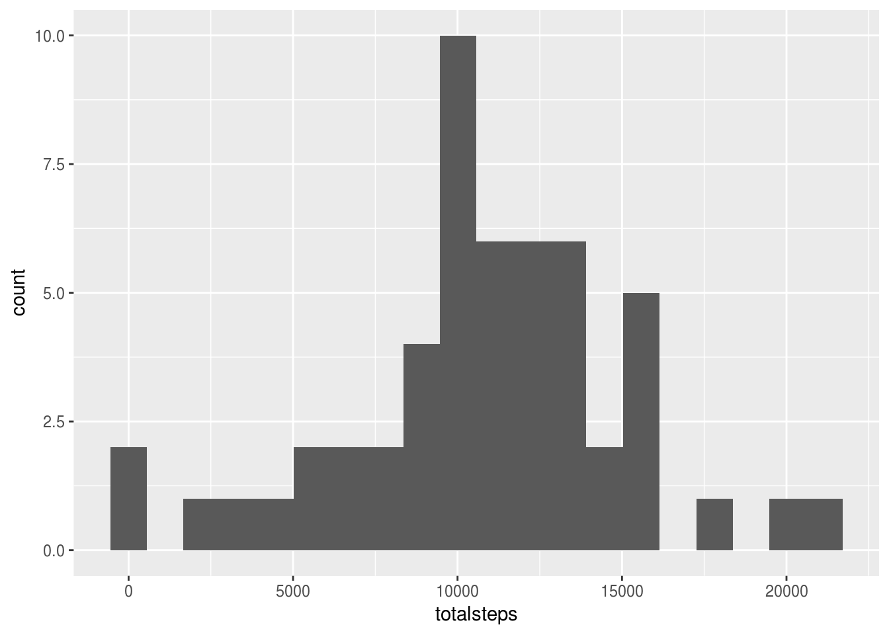

Before anything else, we load the packages we will need to complete the project.


```r
library(dplyr)
```

```
## 
## Attaching package: 'dplyr'
```

```
## The following objects are masked from 'package:stats':
## 
##     filter, lag
```

```
## The following objects are masked from 'package:base':
## 
##     intersect, setdiff, setequal, union
```

```r
library(ggplot2)
```

```
## Need help getting started? Try the cookbook for R:
## http://www.cookbook-r.com/Graphs/
```

## Loading and preprocessing the data

First we need to load the CSV data. The following code assumes there is a file named
`activity.csv` in the working directory that contains the data for this project.

We pass the column classes to the `read.csv` function to get the `date` column already
as a `Date` class.


```r
activity <- read.csv("activity.csv", header = TRUE,
                     colClasses = c("integer", "Date", "integer"))
```

## What is mean total number of steps taken per day?

Let's aggregate the dataset by day, taking the sum of steps for each day.
We do this using the `group_by` and `summarise` functions on the `dplyr` package.
Then we plot the histogram of this aggregated data. Twenty bins seems to be a good
number for visualizing the distribution of the data.


```r
activity.by.day <- group_by(activity, date) %>% summarise(totalsteps = sum(steps))

qplot(totalsteps, bins = 20, data = activity.by.day)
```

```
## Warning: Removed 8 rows containing non-finite values (stat_bin).
```



Now let's take the mean and the median of the total number of steps per day. We need
to use the option `na.rm = TRUE` to deal with the missing data.


```r
mean(activity.by.day$totalsteps, na.rm = TRUE)
```

```
## [1] 10766.19
```

```r
median(activity.by.day$totalsteps, na.rm = TRUE)
```

```
## [1] 10765
```

## What is the average daily activity pattern?

This time we need to group by the `interval` column and instead of taking the sum
of `steps` we are going to take the mean, not forgetting to eliminate the missing
the values by setting the appropriate option.

Then we are going to plot the data in a line plot to observe the typical day of
this subject when it comes to number of steps taken.


```r
activity.by.interval <- group_by(activity, interval) %>% 
                  summarise(meansteps = mean(steps, na.rm = TRUE))

qplot(interval, meansteps, geom = "line", data = activity.by.interval)
```


```r
activity.by.interval$interval[which.max(activity.by.interval$meansteps)]
```

```
## [1] 835
```

The maximum number of steps is typically taken on the 5-minute interval designated
by 835, as you can see in the code above.


## Imputing missing values

The only column containing missing values is the `steps` column, as you can
see below in the summary report of the dataset. The total number of missing
values is 2304.

To calculate it more explicitly we can use the `sum` and `is.na` functions.


```r
summary(activity)
```

```
##      steps             date               interval     
##  Min.   :  0.00   Min.   :2012-10-01   Min.   :   0.0  
##  1st Qu.:  0.00   1st Qu.:2012-10-16   1st Qu.: 588.8  
##  Median :  0.00   Median :2012-10-31   Median :1177.5  
##  Mean   : 37.38   Mean   :2012-10-31   Mean   :1177.5  
##  3rd Qu.: 12.00   3rd Qu.:2012-11-15   3rd Qu.:1766.2  
##  Max.   :806.00   Max.   :2012-11-30   Max.   :2355.0  
##  NA's   :2304
```

```r
sum(is.na(activity))
```

```
## [1] 2304
```

Since the presence of missing days may introduce bias into some
calculations or summaries of the data, we need to devise a strategy to
fill in the missing data.

Since the principal interest of this dataset is to study the pattern of
each day it makes sense to use the mean of the missing 5-minute interval.

We also create a new dataframe `activity.imputed` that is a copy of the
original dataset but with the missing data filled in by the method
described above.


```r
fill.missing <- function (interval, steps) {

  if (is.na(steps)) {
    activity.by.interval[activity.by.interval$interval == interval, "meansteps"]
  } else {
    steps
  }
}

steps.imputed <- as.numeric(mapply(fill.missing, activity$interval, activity$steps))
activity.imputed <- activity
activity.imputed$steps <- steps.imputed
```

Now we plot the total number of steps taken per day as a histogram.


```r
activity.imputed.by.day <- group_by(activity.imputed, date) %>% 
  summarise(totalsteps = sum(steps))

qplot(totalsteps, bins = 20, data = activity.imputed.by.day)
```


We also report the mean and median of this vector. Note that the mean is unchanged
and the median only increases by about 2 steps. This is largely insignificant given
the large number of steps taken each day. We can thus conclude that imputing the
missing values does not make a significant impact on the data.


```r
mean(activity.imputed.by.day$totalsteps)
```

```
## [1] 10766.19
```

```r
median(activity.imputed.by.day$totalsteps)
```

```
## [1] 10766.19
```

```r
mean(activity.imputed.by.day$totalsteps) - mean(activity.by.day$totalsteps, na.rm = TRUE)
```

```
## [1] 0
```

```r
median(activity.imputed.by.day$totalsteps) - median(activity.by.day$totalsteps, na.rm = TRUE)
```

```
## [1] 1.188679
```


## Are there differences in activity patterns between weekdays and weekends?

First we need to determine ,for every date in the dataset, if it is a weekday
or a weekend. For that we create the function `is.weekend` which returns
`"weekend"` if the date is on a weekend and returns `"weekday"` otherwise.

We then create a new column on `activity_imputed` which is a factor variable that
states if the date is a weekday or a weekend.


```r
is.weekend <- function (date) {
  weekend.days <- c("Saturday", "Sunday")
  if (weekdays(date) %in% weekend.days) {
    "weekend"
  } else {
    "weekday"
  }
}

activity.imputed$weekday.or.weekend <- as.factor(sapply(activity.imputed$date, 
                                                        is.weekend))
```

Now we need to group the data by this factor and then by interval. Then we
summarise the data by taking the average steps taken in each group.


```r
activity.by.weekday.and.interval <- group_by(activity.imputed,
                                             weekday.or.weekend,
                                             interval) %>%
                                    summarise(steps = mean(steps))
```

Now we can plot the mean steps taken in each interval of the day split
by weekday and weekend.

We can see some significant differences in the typical patterns of a weekday
and a weekend. In the weekdays there is strong activity from interval 500 and
a really high peak at around 800. In the weekends activity starts to pickup
much more gradually from 500 with its peak also at 800.

Besides the early hours of the morning activity seems to be greater during
the day on the weekends than on the weekdays.

```r
qplot(interval, steps, data = activity.by.weekday.and.interval,
      geom = "line", facets = . ~ weekday.or.weekend)
```


